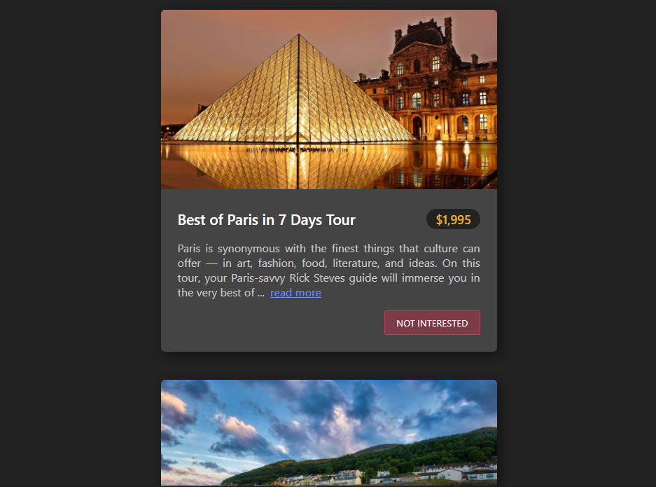

  
  <h1>Tour App</h1>
  

    A Tour application with ReactJs, in which you can delete the tour card which you are not interested in or refresh the page to see all the tours again.
  

  
In the project directory, you can run:

  <pre>npm start</pre>
  

    It runs the app in the development mode. Open
    <a href="http://localhost:3000">http://localhost:3000</a> to view it in the
    browser.
  

  

    The page will reload if you make edits. You will also see any lint errors in
    the console.
  

  

    Edit the codes and let me know if you have more knowledge or better ideas.
  

